## cluster installation
---------------------------------------------------------------------------------------
* [Refer Here](https://github.com/jaya4606/observability-zero-to-hero/tree/main/day-2) for the installations.
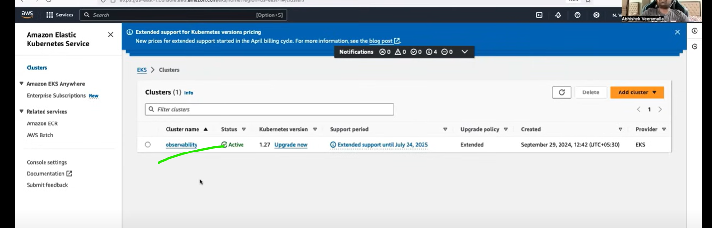
* install helm.
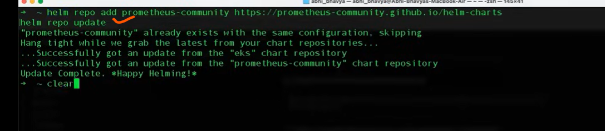
* create a namespace observability.
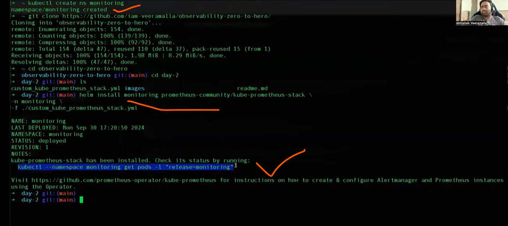
* alert amanger is the custom part.
* do the port forwarding for prometheus and graphana.
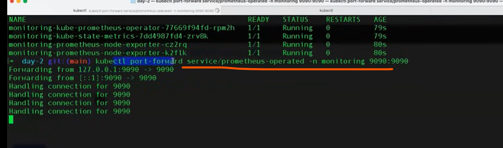
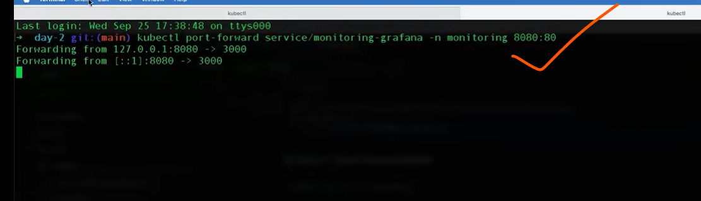
* do port forwarding for premetheus and graphana not use any ingress here.
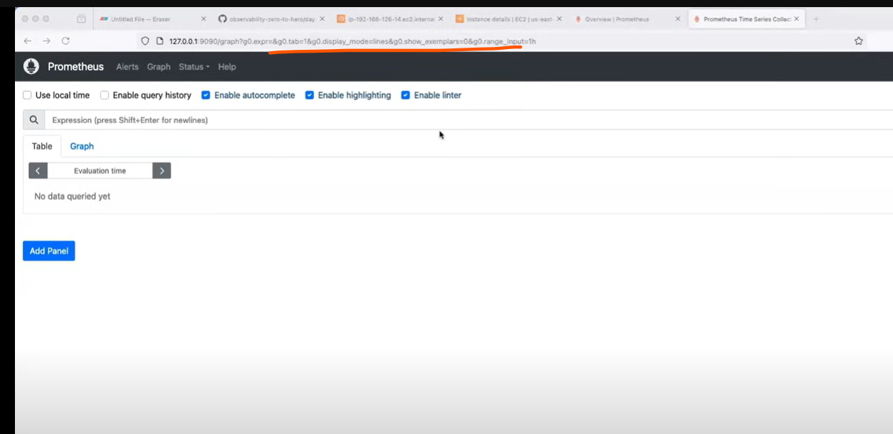
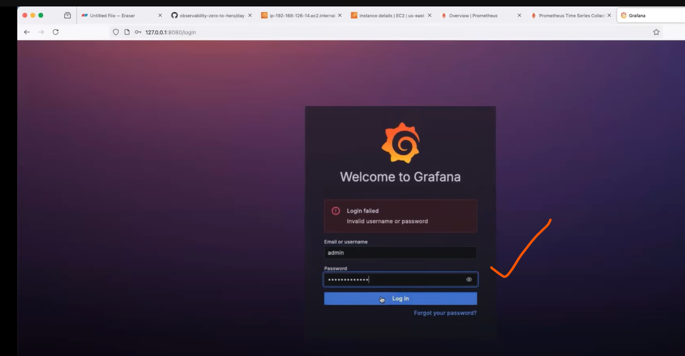
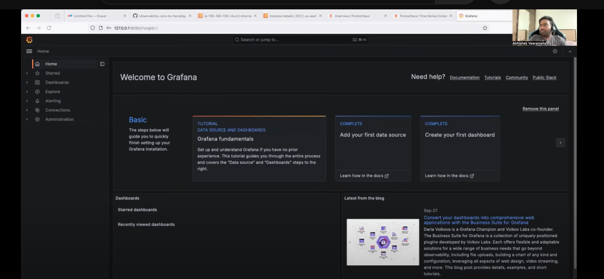
* alert manager
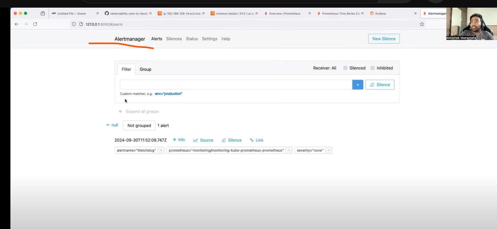
* add datasource as prometheus for graphana.
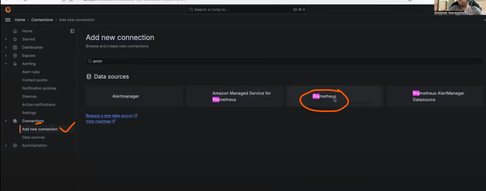
* exporters for prometheus.
  * node exporters.(`infrastructure level metrics`).
    * pull the information from each node.cpu,memory,disk related metrics.
    * it will read the system files of the nodes or virtual machine.
  * kube state metrics exporter(`k8s level metrics`).
    * it will get all information from k8s api server.
    * all pod, events, entire k8s relatd  informations.
    * default installation.
* these two are primary things in prometheus.
* To get the application level metrics,like to get information of http requests, user level signups,how many times a user perform a specific activity on that application.
* to get those deatils the developers of that application should write `metrics server` 
```
/logout - page
/login  - page
/metrics - endpoint
```
* prometheus using the `service discovery` mechanism to scrape the /metrics endpoint of u r application.
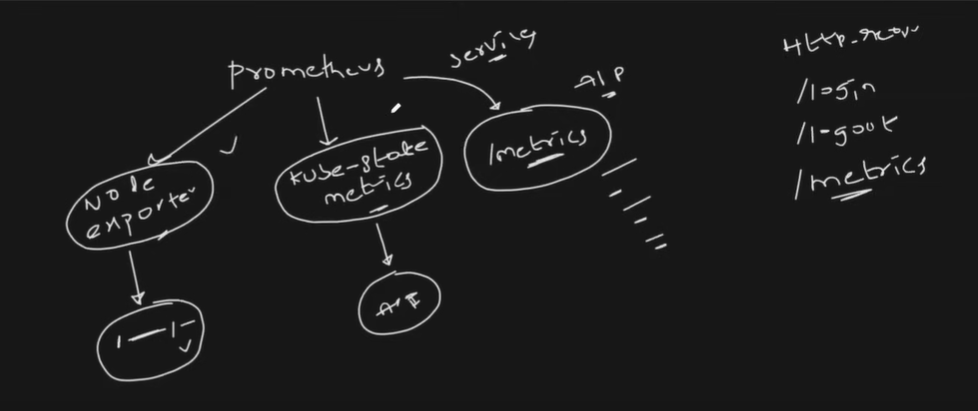
* prometheus is also CNCF project(second).