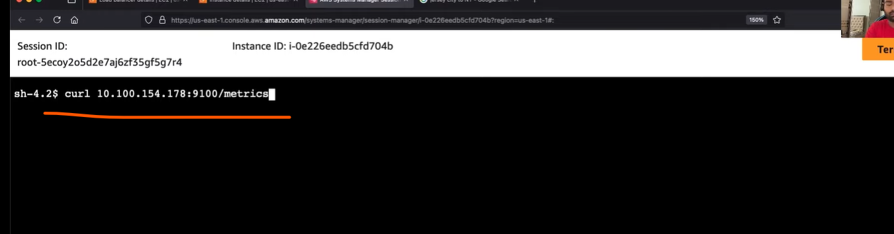

* premetheus scrape these metrics and store them in TSDB.time stamp of metrics.
* prometheus has a `http sever` using this to get the data from TSDB we can write the `promql` query.
* install the eks and configure the all prommetheus, alert manager node exporter,grafana, and prometheus apiserver.
* `node exporters` runs as a `daemonsets`. it has based on nodes, number of pods.

* `kube-state metric` is talk to` k8s api server`. it is only one pod.

* we cannot access it from browser because it has clusterip service.

* goto one of the node and connect the session.

* node exporter will collect the metrics periodically.

* prometheus will get the metrics from node exporters.
  * in node exporter there will be a endpoint called `/metrics` on that node exporter will retirn the output.
* if we want to get the metrics from kube state metric server.

* create a crash pod to check it in prometheus. for that we use busy box.

* as soon as you created the pod `kube api server` receives the information.

## grafana
----------------------------------------------------------------------------------------------------
* grafana provide better dashboards. grafana supports multiple datasources.
* it is independent of prometheus.
* it is a visualization platform.not a monitoring tool.
* in grafana u can set authentication and authorization.
  * integrated with IAM or SSO.

* default dashboards in grafana.

* save the dashboards.
* to add any other dashboards to grfana.

## custom metrics
* prometheus will not look all the servicea and all the pods.
* the no of calls increased cpu memory utilization go high.
## service monitor
* service monitor will tell prometheus services to look for?