## instrumentation
-----------------------------------------------------------------------------------------
* the applications in u r organization ommiting the metrics,logging is not done to application,traces are not provided to the application, it doesnt matter if u have prometheus nagios.
* exporters doesnt pull the specific information of application.
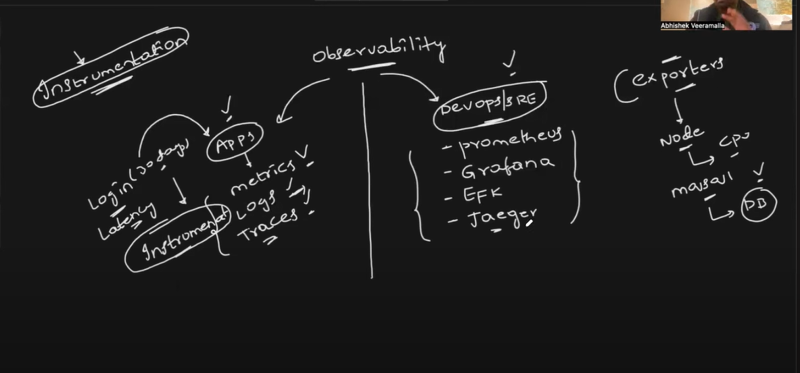
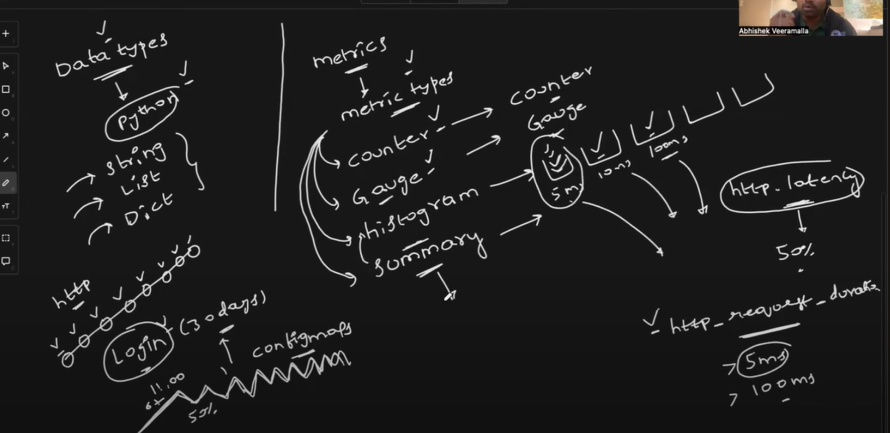
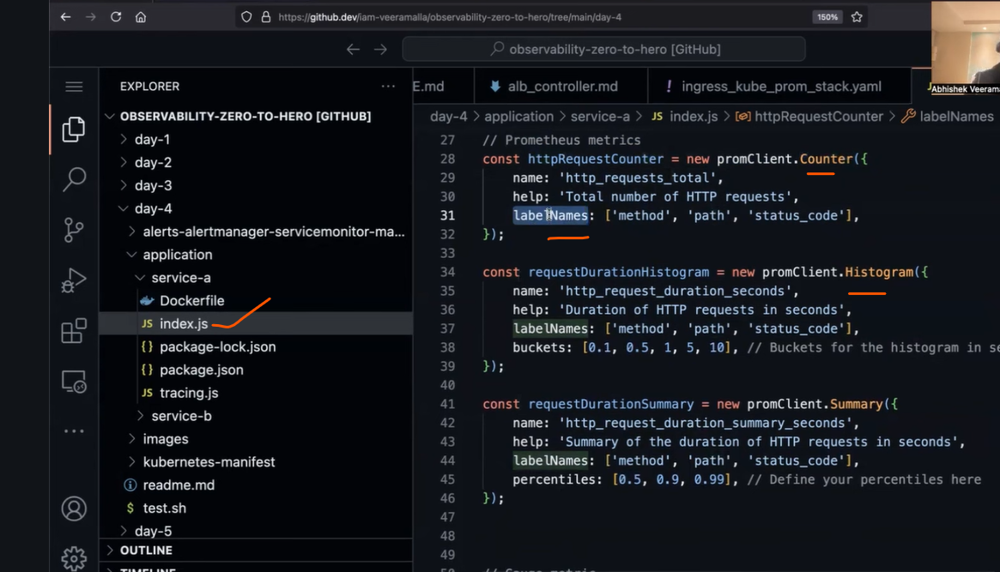
* why prometheus no writing the custom metrics we written.
* how does prometheus know which application service get the custom metrics? for that prometheus has `service discovery`.
* to make service discovery u need to deploy a custom resource or a yaml file.
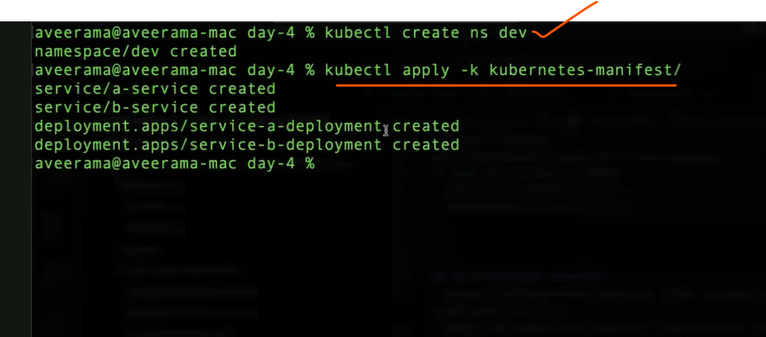
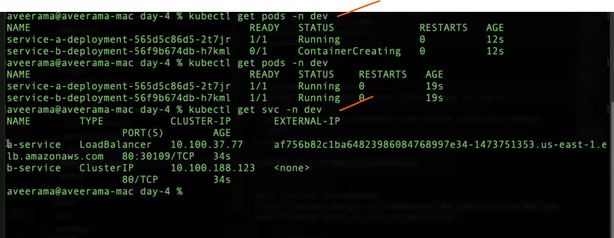
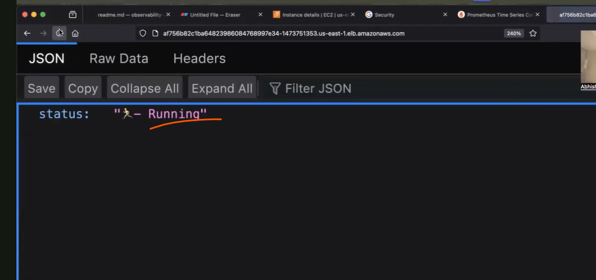
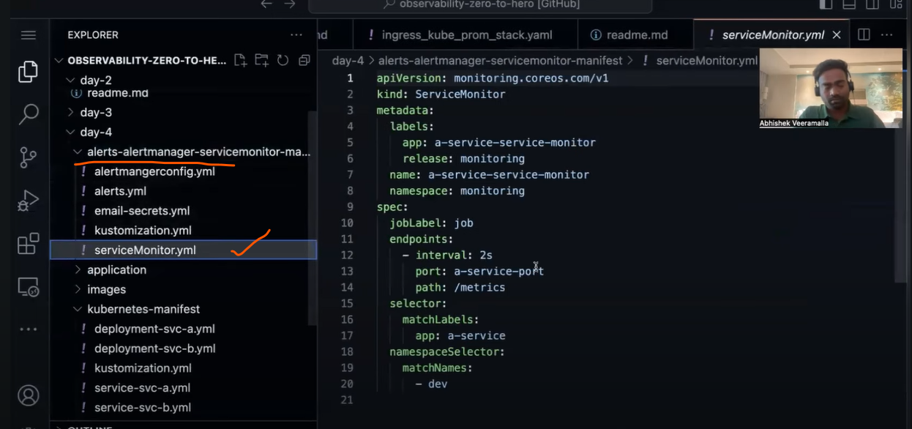
* to get the alerts from alert manager we configure alert manager.
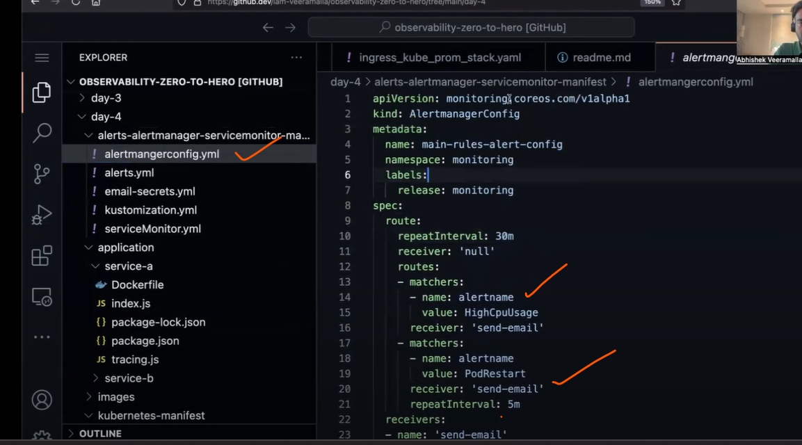
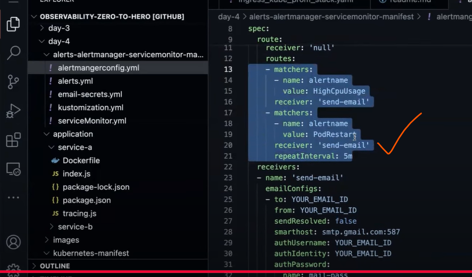
* to confiure the email from the google.for smtp server we need password.
* goto gmail and manage google account.
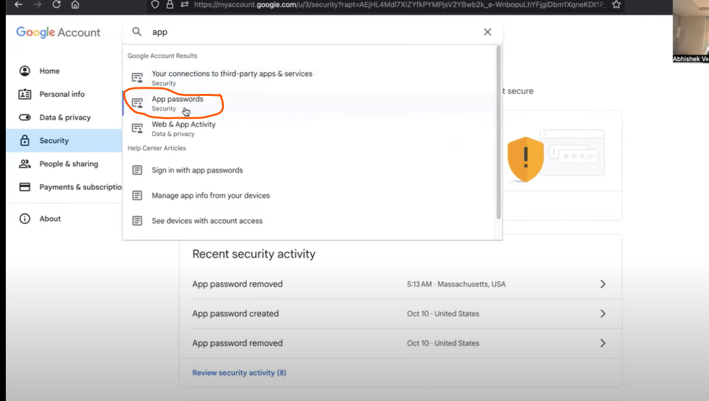
* enable 2 factor authentication in u r email.
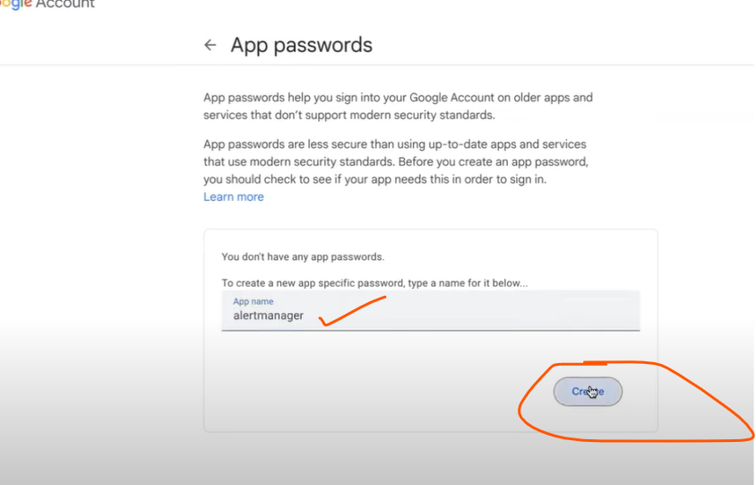
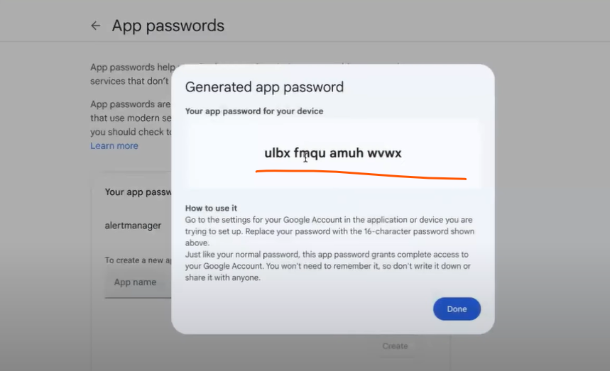
* take the password and convert to base64 encoded formart.
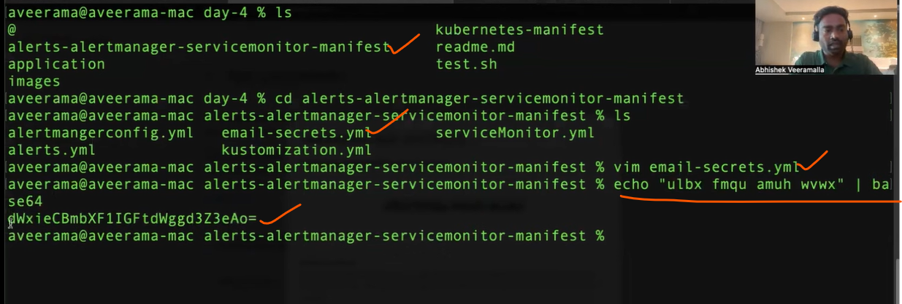
* after that change email details in alertmanager and again run the kustomize.
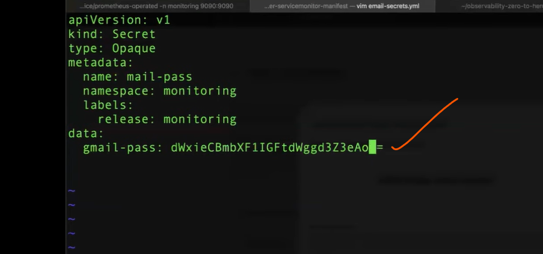
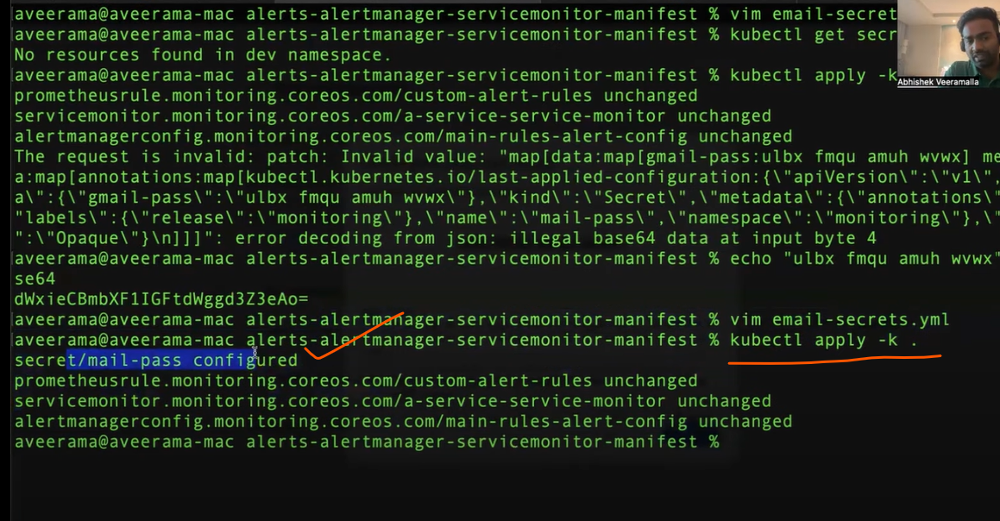
* use the endpoint `crash` in the url. the app will be crashed.
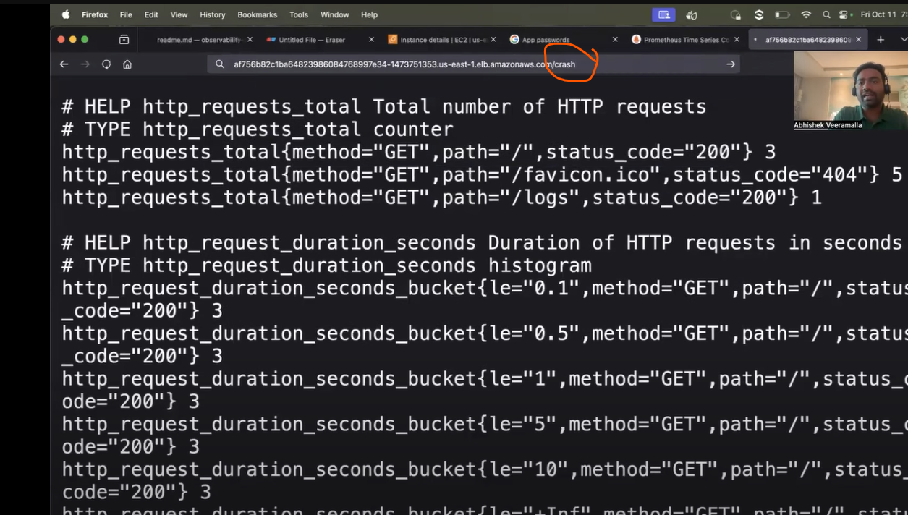
